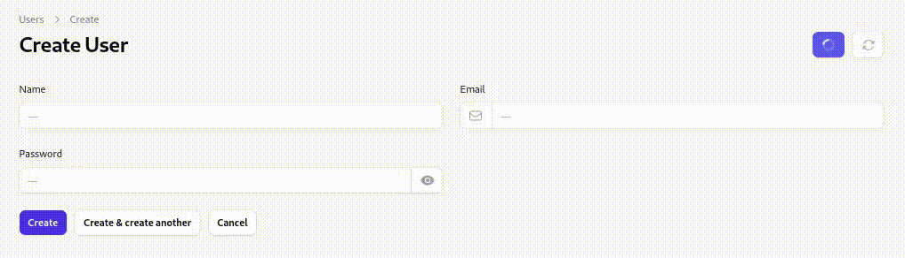

<h1 align="center">↻ Filament fake fill action</h1>

<p align="center">
    <a href="https://github.com/sakanjo/filament-fakefill-action/actions"></a>
    <a href="https://laravel.com"></a>
    <a href="https://php.net"></a>
</p>

<p align="center">A Filament action to fake fill the form state.</p>

> ✨ Help support the maintenance of this package by [sponsoring me](https://github.com/sponsors/sakanjo).



Table of Contents
=================

* [Install](#-install)
* [Usage](#-usage)
  * [On the create page](#on-the-create-page)
  * [On the edit page](#on-the-edit-page)
* [Functions](#functions)
  * [isFakeFilling](#isFakeFilling)
* [Support the development](#-support-the-development)
* [Credits](#%EF%B8%8F-credits)
* [License](#-license)

## 📦 Install

```
composer require sakanjo/filament-fakefill-action
```

## 🦄 Usage

### On the create page

```php
<?php

namespace App\Filament\Admin\Resources\UserResource\Pages;

use App\Filament\Admin\Resources\UserResource;
use Filament\Resources\Pages\CreateRecord;
use SaKanjo\FilamentFakeFillAction\Actions\FakeFillAction;

class CreateUser extends CreateRecord
{
    protected static string $resource = UserResource::class;

    protected function getHeaderActions(): array
    {
        return [
            FakeFillAction::make(),
        ];
    }
}
```

### On the edit page

```php
<?php

namespace App\Filament\Admin\Resources\UserResource\Pages;

use App\Filament\Admin\Resources\UserResource;
use App\Filament\Base\Pages\EditRecord;
use SaKanjo\FilamentFakeFillAction\Actions\FakeFillAction;

class EditUser extends EditRecord
{
    protected static string $resource = UserResource::class;

    protected function getHeaderActions(): array
    {
        return [
            FakeFillAction::make(),
        ];
    }
}
```

## Functions

### isFakeFilling

```php
<?php

namespace Database\Factories;

use App\Models\Address;
use Illuminate\Database\Eloquent\Factories\Factory;
use Illuminate\Support\Facades\Hash;
use Illuminate\Support\Str;

use function SaKanjo\FilamentFakeFillAction\isFakeFilling;

class UserFactory extends Factory
{
    public function definition(): array
    {
        return [
            'name' => isFakeFilling() ? 'Name set from factory' : fake()->name(),
            'email' => fake()->unique()->safeEmail(),
            'email_verified_at' => now(),
            'password' => Hash::make('password'),
            'remember_token' => Str::random(10),
            'address_id' => isFakeFilling() ? Address::query()->inRandomOrder()->first()->getKey() : null,
        ];
    }
}
```

## 💖 Support the development

**Do you like this project? Support it by donating**

Click the ["💖 Sponsor"](https://github.com/sponsors/sakanjo) at the top of this repo.

## ©️ Credits

- [Salah Kanjo](https://github.com/sakanjo)
- [All Contributors](../../contributors)

## 📄 License

[MIT License](https://github.com/sakanjo/filament-fakefill-action/blob/master/LICENSE) © 2023-PRESENT [Salah Kanjo](https://github.com/sakanjo)
